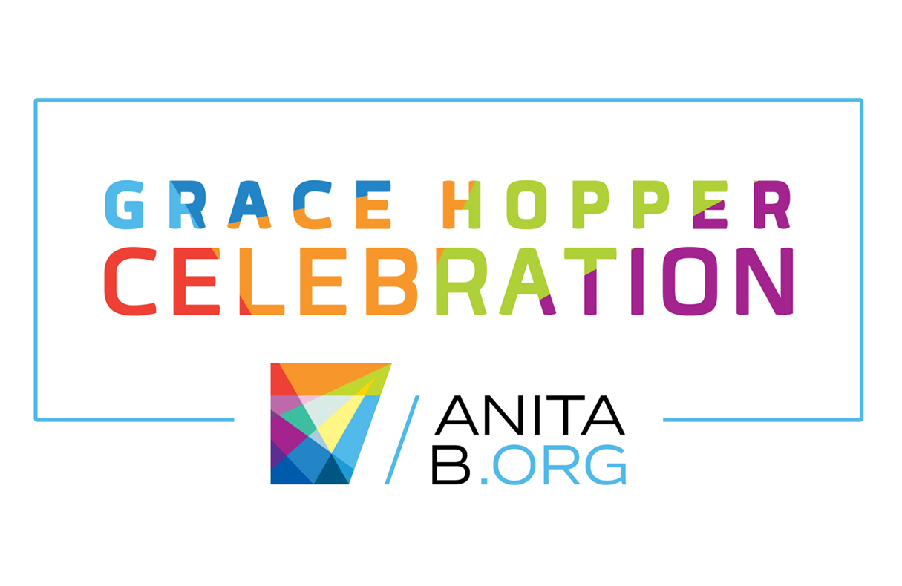
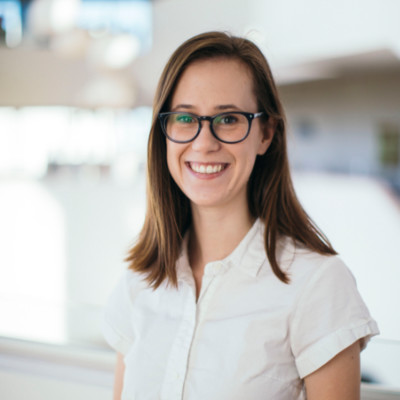
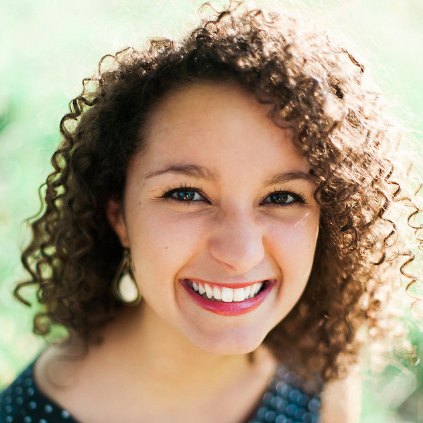

# How To Adult : Professional, Social, & Financial Success in Post-Graduate Life

Virtual Grace Hopper Mentoring Circle  
October 2, 2020  |  1:45 - 2:45 PM EDT  

### 💡 Get Our Tips: [PDF Handout](https://drive.google.com/file/d/16RXBsbmR3y8aVe6NM1FUxbjpdlH6s24A/view?usp=sharing)

### 👩🏼👩🏽‍🦱 Learn About Us:

**Kira Tebbe**

Kira is an MBA Candidate at The University of Chicago Booth School of Business. After graduating college in 2017 with degrees in Applied Math and Sociology, Kira worked as a Data Scientist at IBM and Education First in Boston. In her professional work, Kira uses analysis to discover trends in large amounts of data and explain them using thoughtful visualizations, having published her analysis and visualizations in the peer-reviewed journal ​Drug and Alcohol Dependence.​ She is passionate about supporting other women in STEM, serving as the Co-organizer of the ​Women in Machine Learning and Data Science (WiMLDS) group in Boston, being a guest speaker at local ​Girls Who Code clubs, and being the inaugural speaker at Northeastern’s ​She</Speaks>​, a speaking series that highlights young women in STEM.

🌐 Learn more at her [personal website](https://kiras-website.herokuapp.com/index.html)

🔗 Connect with her on [LinkedIn](https://www.linkedin.com/in/kiratebbe/)

✉️ Connect via email: [kira@tebbe.com](mailto:kira@tebbe.com)

---

**Lauren Chambers**

Lauren is the Staff Technologist at the ACLU of Massachusetts, where she analyzes and explores government data in order to inform citizens and lawmakers about the effects of legislation and political leadership on our civil liberties. She graduated in 2017 from Yale University, completely a double major in astrophysics and African American studies. After graduating, Lauren spent two years as a software developer in Baltimore supporting NASA’s James Webb Space Telescope. During her time at Yale, she mentored dozens of students, in particular women and students of color in STEM, through positions as a Peer Mentor and First-Year Counselor. Lauren struggled to adapt to post-graduate life, and hopes to share with participants what she wishes she had known.

🌐 Learn more at her [personal website](https://laurenmarietta.github.io/)

🔗 Connect with her on [LinkedIn](https://www.linkedin.com/in/lauren-chambers-abbb91b0/)

✉️ Connect via email: [lchambers@aclum.org](mailto:lchambers@aclum.org)
